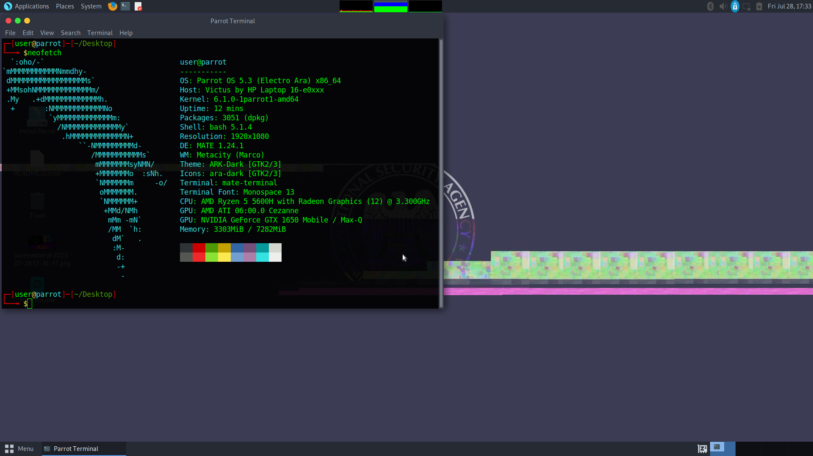
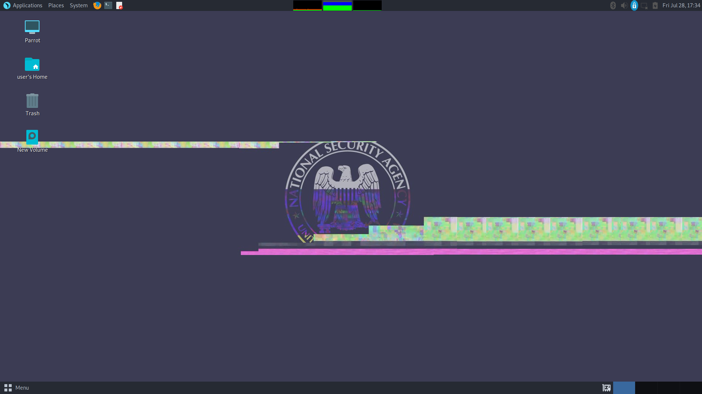

# Parrot OS: Empowering Your Cybersecurity Arsenal 🦜🛡️

## Introduction

Welcome to the comprehensive guide on Parrot OS, a powerful and versatile Linux distribution tailored to meet the needs of cybersecurity enthusiasts, penetration testers, and privacy-conscious individuals. With its strong emphasis on security, vast array of cybersecurity tools, and commitment to user privacy, Parrot OS stands out as the ultimate choice for anyone seeking a robust and reliable cybersecurity platform.

## Table of Contents

1. [What is Parrot OS?](#what-is-parrot-os)
2. [Key Features](#key-features)
3. [Editions](#editions)
4. [Tools for Cybersecurity](#tools-for-cybersecurity)
5. [Privacy and Anonymity](#privacy-and-anonymity)
6. [Community and Support](#community-and-support)
7. [Getting Started](#getting-started)
8. [Conclusion](#conclusion)

## What is Parrot OS?

Parrot OS is an advanced, Debian-based Linux distribution developed by the ParrotSec team. Its primary focus lies in the realm of cybersecurity, making it an invaluable tool for ethical hackers, security researchers, digital forensics experts, and anyone interested in safeguarding their online presence. The OS offers a perfect balance between robust security, performance, and ease of use, making it suitable for both beginners and experienced users.

## Key Features

Parrot OS boasts an impressive array of features that set it apart from other Linux distributions:

-   **Security First**: Parrot OS prioritizes security above all else, equipping users with a comprehensive set of tools for ethical hacking, vulnerability assessment, digital forensics, and network analysis.

-   **Wide Range of Tools**: From information gathering and scanning to exploitation and post-exploitation, Parrot OS comes with an extensive collection of cybersecurity tools, enabling professionals to conduct thorough security assessments.

-   **Lightweight and Fast**: Despite its rich feature set, Parrot OS is designed to be lightweight and optimized for performance. It runs smoothly on a variety of hardware configurations, making it suitable for both desktop and cloud environments.

-   **Customizability**: Parrot OS empowers users with the freedom to tailor their installation to meet their specific needs. This level of customization ensures that professionals have access to the tools they require for their cybersecurity endeavors.

## Editions

Parrot OS offers different editions to cater to various use cases:

-   **Home Edition**: The Home Edition is designed for everyday users seeking a secure and reliable OS for their daily computing needs. It comes equipped with essential security tools and a user-friendly interface.

-   **Security Edition**: The Security Edition is tailored for cybersecurity professionals and penetration testers. It provides an extensive selection of tools for advanced security testing, vulnerability assessments, and penetration testing.

-   **IoT Edition**: The IoT Edition focuses on security analysis and assessment for Internet of Things (IoT) devices and environments. It enables professionals to identify vulnerabilities in connected devices and systems.

-   **Cloud Edition**: The Cloud Edition is optimized for cloud-based environments, offering security tools tailored to virtualized and containerized platforms.

## Tools for Cybersecurity

Parrot OS comes bundled with a diverse range of cybersecurity tools that address various aspects of security assessment, including:

-   **Metasploit**: A powerful penetration testing framework for assessing and exploiting vulnerabilities.

-   **Wireshark**: A top-notch network protocol analyzer for deep packet inspection and network troubleshooting.

-   **Nmap**: The industry-standard network mapping and scanning tool used for discovering hosts and services on a computer network.

-   **Burp Suite**: A web vulnerability scanner and security testing tool for identifying security flaws in web applications.

-   **Ghidra**: A reverse engineering suite developed by the NSA for analyzing binaries and conducting software analysis.

## Privacy and Anonymity

Parrot OS places a strong emphasis on user privacy and anonymity. It integrates the Tor network, providing users with anonymization tools to browse the internet securely and anonymously. This feature is especially valuable for users concerned about protecting their online activities from surveillance and tracking.

## Community and Support

The Parrot OS community is vibrant and active, consisting of cybersecurity enthusiasts, professionals, and developers. The community provides extensive documentation, actively contributes to development, and offers support through forums, chat channels, and mailing lists. Parrot OS users can find assistance, share knowledge, and collaborate on improving the OS.

## Getting Started

Are you ready to unleash the power of Parrot OS in your cybersecurity journey? Visit the official Parrot OS website (https://www.parrotsec.org/) to explore the various editions, download the ISO image, and begin your adventure into the world of ethical hacking and cybersecurity.

## Conclusion

Parrot OS is a feature-rich and secure Linux distribution that empowers cybersecurity professionals and enthusiasts alike. With its vast array of tools, commitment to user privacy, and a supportive community, Parrot OS offers a comprehensive and versatile platform for conducting ethical hacking, vulnerability assessments, and digital forensics. Embrace the parrot, and soar into the realm of cybersecurity with confidence and agility! 🦜🛡️ #ParrotOS #Cybersecurity #EthicalHacking #Linux
